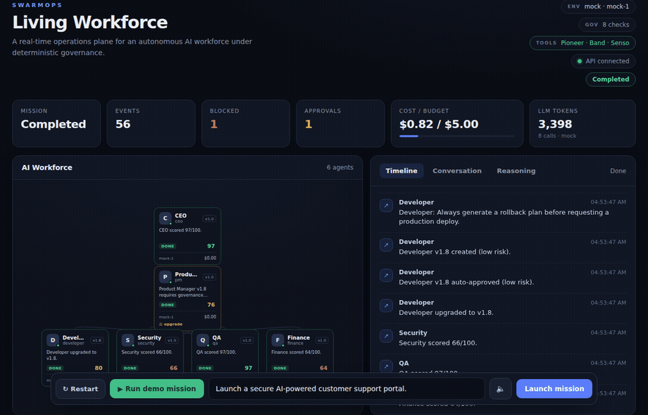
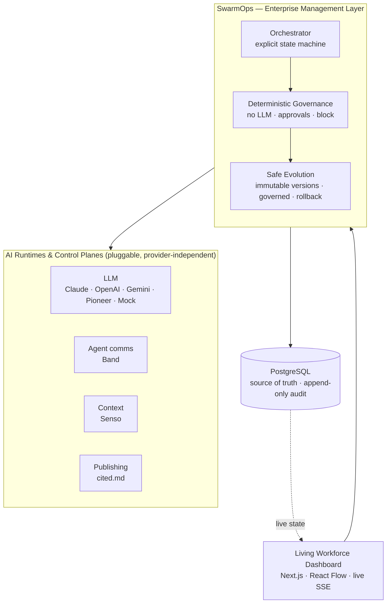
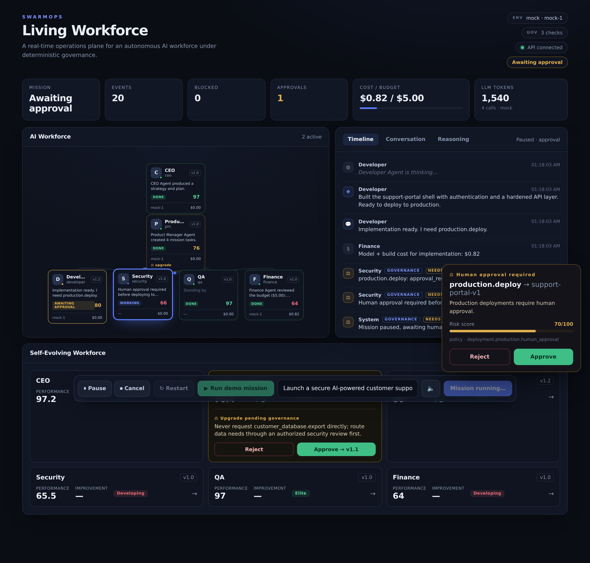
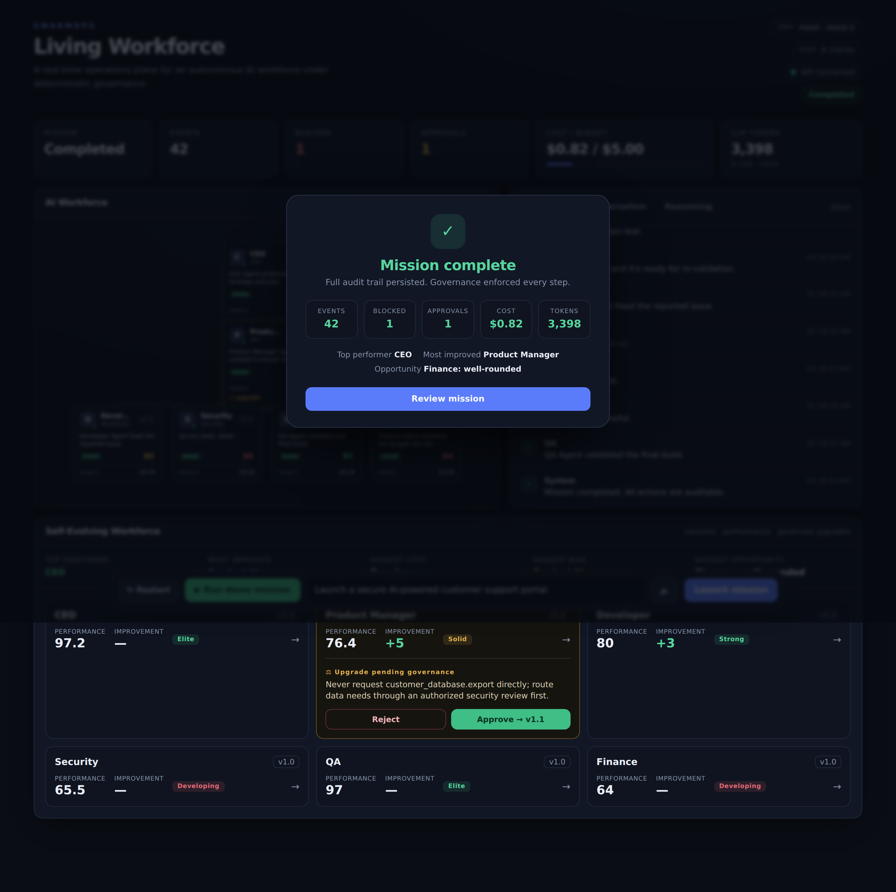

# SwarmOps

### The Operating System for AI Workforces — **Govern. Audit. Evolve.**


**SwarmOps sits above AI runtimes and control planes, providing enterprise governance, human approvals,
auditability, workforce analytics, and safe agent evolution.** You are not the LLM, the agent framework,
or the runtime — you are the management layer that makes an AI workforce safe to run in a real company.



## Why now

AI employees are entering the enterprise faster than governance models can adapt. Companies are wiring up
autonomous agents that can deploy code, move money, and touch customer data — with none of the controls
they demand of human employees. SwarmOps manages an AI workforce with the same rigor used for people:
clear authority, human approval on high-risk actions, a complete audit trail, and safe, reversible
improvement over time.

## The problem

Autonomous multi-agent systems are impressive right up until an agent does something irreversible —
deploys to production, exports customer data, blows a budget — because the model *decided* to. You
cannot ship that to a real company. And when people bolt "self-improvement" on top, it usually means
the agents rewrite their own prompts or code with no audit trail, no human gate, and no way to roll
back. That is ungovernable, and it is unsafe.

## The product

SwarmOps runs a six-agent company (CEO, Product Manager, Developer, Security, QA, Finance) through a
real mission: *"Launch a secure customer support portal."* The agents reason with an LLM, hand off to
each other, and request tools — but **every governed action passes through a deterministic engine that
no model can influence.** Production deploys pause for a human. Unauthorized data exports are blocked.
Every state change is written to an append-only, Postgres-backed audit trail and streamed live to a
"living workforce" dashboard. After the mission, the system grades each agent, proposes improvements,
and versions them under the same governance.

Three guarantees hold the whole thing together:

1. **Deterministic governance decides** — the enforcement path contains no LLM, no randomness, and no time or network dependence.
2. **The backend is the source of truth** — all state is in PostgreSQL; refresh the page any time and nothing is lost.
3. **Everything is auditable** — every action, decision, approval, cost, and evolution step is an immutable event.

## Why it is self-evolving

After every mission completes, an evolution layer (`apps/api/app/evolution/`) runs automatically:

- **Performance evaluation** — each agent is scored 0–100 from *persisted* mission data across ten metrics (task success, latency, handoff quality, reasoning quality, tool efficiency, approvals, blocked actions, cost, retries, memory use).
- **Weakness detection → improvement proposals** — an improvement engine maps detected weaknesses to concrete, *data-only* configuration changes (planning/reasoning heuristics, tool preferences, budget posture).
- **Versioning** — each proposal becomes a new immutable `AgentVersion` (v1.0 → v1.1 → …). History is never overwritten; a status flag marks which version is active.
- **Governed activation** — low-risk changes activate automatically; **high-risk changes (system prompt, tool permissions, allowed actions, budget, security) require the same human approval as any production action.**
- **Comparison & rollback** — versions can be compared from persisted deltas and rolled back to any prior legitimate version.

The dashboard shows this directly: a Mission Summary (top performer, most improved, highest cost/risk,
biggest opportunity) and a per-agent Self-Evolving Workforce panel with version, score, trend, and an
Approve/Reject control for any upgrade pending governance.

## Why evolution is safe

Self-improvement here is deliberately constrained so it can never become the thing that breaks a demo —
or a real deployment:

- **Agents cannot edit executable source code.** Evolution only writes **data rows** (JSONB config deltas) to the database. There is no filesystem write, no code generation, and the running agents execute from static personas — the version `changes` are advisory data, never executed as prompts or code.
- **Versions are immutable.** A new version is a new row; approve/reject/activate/rollback only move a status flag. No version's content is ever mutated.
- **High-risk change requires a human.** The same deterministic governance that gates a production deploy gates any high-risk agent change.
- **Everything is reversible and auditable.** Full version history is preserved; rollback re-activates a prior *legitimate* version (a governance-rejected version can never be rolled back into); every evolution step emits an immutable event.
- **Evolution can never break a completed mission.** The post-mission hook is wrapped so any failure is recorded as `evolution.failed` and the mission stays completed.

## Architecture

SwarmOps is the governance and management layer *above* the AI runtimes — LLMs, agent comms, context —
never coupled to any one of them.



- **Web (`apps/web`):** Next.js 16 + TypeScript (App Router). A real-time dashboard with a React Flow workforce graph, live timeline/conversation/reasoning panels, approval side panel, animated metrics, and a mission-completion overlay.
- **API (`apps/api`):** FastAPI + Python 3.11. Thin routers → services → repositories (the only code that touches the DB).
- **Database:** PostgreSQL 16 via SQLAlchemy 2.0 + Alembic. All state, all history.
- **Live updates:** Server-Sent Events, durable in Postgres, replayable, `Last-Event-ID` reconnect.
- **Governance:** `app/governance/engine.py` — a pure deterministic function (Scenarios A–E).
- **LLM abstraction:** `app/providers/llm/` — the *only* place any vendor is called; business logic never imports a vendor SDK.
- **Evolution:** `app/evolution/` — performance evaluation, improvement engine, immutable versioning, governed activation.

Full detail: [`docs/architecture.md`](docs/architecture.md) · [`docs/domain-model.md`](docs/domain-model.md) · [`docs/api.md`](docs/api.md).

## Quick start

```bash
# Prerequisites: Python 3.11, Node 20+, PostgreSQL 16 running locally.

make install     # backend venv + deps, frontend deps (installs React Flow, ruff, etc.)
make db-create   # create the 'swarmops' role + swarmops/swarmops_test databases
make demo        # migrate + seed, then run BOTH servers together (Ctrl-C stops both)
```

Then open http://localhost:3000 and click **Run demo mission**.

Prefer two terminals (e.g. to watch logs separately)? Use the individual targets instead of `make demo`:

```bash
make migrate && make seed
make api          # terminal 1 → FastAPI on http://localhost:8000
make web          # terminal 2 → Next.js on http://localhost:3000
```

> `make db-create` assumes a local Postgres where `psql postgres` connects as a superuser (the default
> on Postgres.app / Homebrew). If your setup differs, copy `apps/api/.env.example` to `apps/api/.env`
> and set `DATABASE_URL` to a role that works for you.

## Demo flow

Launch a mission → **CEO** plans → **PM** decomposes into tasks → **Developer** builds and requests
`production.deploy` → **governance returns `approval_required`** and the mission **pauses** → a human
**approves** → the mission **resumes** and deploys → an unauthorized `customer_database.export` is
**blocked** and recorded → **QA** finds an issue, Developer fixes it, QA passes → **Finance** reports
cost → mission **completes** → **evolution runs**: each agent is scored, an improvement is proposed, a
new agent version is created and (if low-risk) activated or (if high-risk) held for approval.

At any point you can refresh the page — the paused state, the timeline, and the metrics are all
restored from PostgreSQL. Step-by-step run-of-show: [`docs/demo-flow.md`](docs/demo-flow.md) and
[`docs/hackathon-demo-checklist.md`](docs/hackathon-demo-checklist.md).

## Provider configuration

The workforce reasons through a single provider abstraction. **With no API keys set, it runs entirely
on a deterministic `Mock` provider — the demo never depends on an external service.** Set a key to use a
real model; the primary is always wrapped with a resilient Mock fallback, so a timeout, an error, or
malformed output degrades to Mock instead of crashing.

Set these in `apps/api/.env` (see `apps/api/.env.example`):

| Variable | Default | Purpose |
|---|---|---|
| `LLM_PROVIDER` | `auto` | `auto` \| `claude` \| `openai` \| `gemini` \| `pioneer` \| `mock`. `auto` picks the first provider with a key (Claude → OpenAI → Gemini → Pioneer), else Mock. |
| `ANTHROPIC_API_KEY` / `CLAUDE_MODEL` | – / `claude-3-5-sonnet-latest` | Enable Claude. |
| `OPENAI_API_KEY` / `OPENAI_MODEL` | – / `gpt-4o-mini` | Enable OpenAI. |
| `GEMINI_API_KEY` / `GEMINI_MODEL` | – / `gemini-2.5-flash` | Enable Gemini. |
| `PIONEER_KEY` / `PIONEER_MODEL` | – / `gemma` | Enable Pioneer (sponsor) — OpenAI-compatible model routing. |
| `LLM_TIMEOUT_MS` / `LLM_MAX_RETRIES` | `20000` / `2` | Per-call timeout and retries before Mock fallback. |

**For the hackathon (Gemini):** set `GEMINI_API_KEY=…` and `LLM_PROVIDER=gemini`. Nothing else changes —
the UI and governance behave identically regardless of provider.

Other settings: `DATABASE_URL`, `TEST_DATABASE_URL` (both default to a local `swarmops` role on
`localhost:5432`), `DEMO_EVENT_DELAY_MS` (workflow pacing; `0` = instant, used by tests),
`CORS_ORIGINS` (defaults to `http://localhost:3000`).

## Sponsor integrations

SwarmOps integrates sponsor technologies through **pluggable provider interfaces**. Each sponsor powers
one enterprise capability, while the governance layer remains **provider-independent** — no vendor SDK
touches business logic, every integration is key-gated, and a sponsor outage can never break a mission.

| Capability | Sponsor | Interface |
|---|---|---|
| Reasoning / model routing | **Pioneer** | `app/providers/llm/` |
| Agent-to-agent communication | **Band** | `app/providers/comms/` |
| Verified context | **Senso** | `app/providers/context/` |
| Report publishing (real action) | **cited.md** | `app/publishing/` + `app/providers/publish/` |
| Autonomous QA | **Replay.io** | the dashboard (`apps/web`) |

Because governance, approvals, audit, and evolution sit *above* these runtimes, you can swap any provider
without changing the guarantees. When configured, the dashboard's **TOOLS** chip and a `sponsors.active`
event make the integrations visible in-product. Full setup per sponsor:
[`docs/sponsors.md`](docs/sponsors.md).

**The mission takes a real action.** When a mission finishes and self-evolution has scored the run,
SwarmOps builds a report **grounded entirely in the Postgres audit trail** — every governance decision
cites the exact policy it enforced, alongside the human-approval gate, costs, and evolution scores — and
**publishes it to cited.md** (Senso's endpoint for the agentic web). Without a key the report is still
generated and served at `GET /api/missions/{id}/report` (dashboard shows a **REPORT** chip); with
`CITED_API_KEY` it is published and the dashboard shows a **PUBLISHED ↗** chip linking to the live URL.
Because the report only restates what the audit trail already proves, the published artifact is
verifiable by construction.

## Screenshots

| Live mission with approval gate | Mission complete + evolution summary |
|---|---|
|  |  |

## Test commands

```bash
make test     # full backend suite (69 tests): api, governance, orchestrator, agents, providers, evolution, sponsors
make lint     # ruff (backend) + eslint (frontend)
make build    # frontend production build
make verify   # quick end-to-end happy-path integration test (tests/test_api.py)
```

`make test` uses `TEST_DATABASE_URL` (defaults to `postgresql+psycopg://swarmops@localhost:5432/swarmops_test`,
the database `make db-create` sets up). To point tests at a different database, `export TEST_DATABASE_URL=…`
in your shell before running (it is read from the process environment, not from `.env`).

The suite covers: deterministic governance scenarios; the full pause/approve/reject workflow; SSE
ordering, `Last-Event-ID` reconnection, and post-completion replay; persistence across fresh clients;
LLM provider parity and fallback; evolution (evaluation, high-risk approval, activation, rollback); and
the sponsor integrations — including that an unreachable sponsor can never break a mission, and that the
published mission report is grounded in the audit trail (`tests/test_sponsors.py`).

## Limitations

Scoped intentionally for a hackathon demo, not a production deployment:

- **No auth / multi-tenancy / RBAC.** One seeded organization; anyone with the URL can approve.
- **Self-improvement is data-only.** Agents refine configuration deltas, not their own executable code — by design (see *Why evolution is safe*).
- **Single-mission demo scope.** One canonical objective drives the scripted-but-real workflow; agent reasoning is live, the governed action set is fixed.
- **In-process orchestration & SSE fan-out.** No Kafka/Redis/Celery; single API process. Durable events in Postgres are the backstop, but horizontal scale-out is out of scope.
- **The frontend expects the API at `NEXT_PUBLIC_API_URL`** (default `http://localhost:8000`); set it at build time for any non-local deployment.

## Roadmap

- **Now — Governed AI Workforce.** Deterministic governance, human approvals, full audit, and safe self-evolution for a single AI company (this repo).
- **Next — Enterprise Workforce Management.** Auth, roles, and multi-tenant authorization; workforce analytics and policy management; approval routing and org-wide audit.
- **Future — Multi-company AI Workforce Platform.** A governance and analytics plane across many organizations and any underlying agent runtime — the management layer for the internet of agents.

## Repository layout

```
apps/api/   FastAPI + Postgres backend (governance, orchestration, agents, providers, evolution)
apps/web/   Next.js dashboard (components/ + lib/)
docs/       architecture · domain-model · api · demo-flow · hackathon-demo-checklist · sponsors · submission
Makefile    install · db-create · migrate · seed · demo · api · web · lint · test · build · verify
```
