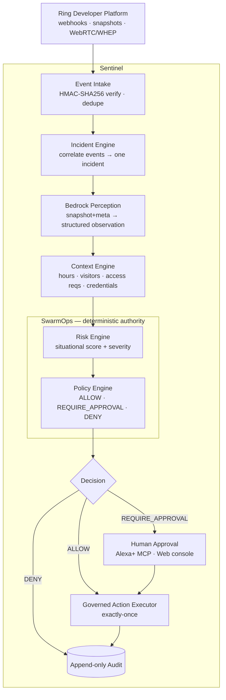

# Sentinel — AI Security Officer for Ring

### Turn Ring from a camera that watches the door into a security officer that **understands, evaluates risk, follows policy, asks for approval, acts — and records exactly what happened.**


**Sentinel** is an AI security officer for a commercial entrance. **Ring** gives it eyes,
**Amazon Bedrock** gives it understanding, **SwarmOps** gives it boundaries, and a **human**
retains authority over consequential actions.

> **Core principle — intelligence may be probabilistic, authority must be deterministic, and
> no LLM may authorize its own action.** Bedrock *describes* the scene; a deterministic policy
> engine *decides*; a human *approves* anything consequential. Every step is on an append-only
> audit trail.

Built for the **Build, Ship, Shape: Amazon Developer Hackathon** (Ring track + AWS Builder).
Sentinel is built on top of an existing SwarmOps governance core — see
[Provenance](#built-on-swarmops-honest-disclosure).

## The winner moment

Open **`/sentinel`**, press **START DEMO** — a scripted-but-real 23:42 entrance incident:

```
23:42  RING       motion ×3 at a closed entrance (real, HMAC-signed events ingested)
       BEDROCK    perception → { person_present, prolonged, repeated, confidence } (no authority)
       CONTEXT    building_open=false · expected_visitor=none · access_request=none · credential=none
       RISK       CRITICAL (100/100) — deterministic, no LLM

  AI  recommends:  GRANT TEMPORARY ACCESS
  SwarmOps:        DENIED  →  Outside business hours · No verified visitor ·
                             No approved access request · No valid credential

  AI  recommends:  SEND WARNING
  SwarmOps:        HUMAN APPROVAL REQUIRED (role: security)
       HUMAN       approves (web console or Alexa+)
       EXECUTOR    warning delivered — EXACTLY ONCE
       REPLAY      same request again → DUPLICATE BLOCKED (one execution only)
       AUDIT       full chain recorded, append-only
```

The differentiator is not the AI — it is the **restraint**: an AI that recommends an action and is
**denied by a rule it cannot override**, with a human in the loop for the rest.

## Architecture



| Layer | Role | Where |
|-------|------|-------|
| **Sensing** | eyes & ears at the door | `app/sentinel/ring/` — Ring Partner API (`api.amazonvision.com`), HMAC-signed webhooks, Playground simulator |
| **Intelligence** | understand the scene | `app/sentinel/perception/` — Amazon Bedrock (Converse), strict-JSON observation; no authority fields |
| **Authority** | risk + policy | `app/sentinel/governance/` — deterministic, typed, versioned (`policy_hash`); no LLM, no `eval` |
| **Officer** | incidents, approvals, exactly-once execution | `app/sentinel/officer/`, `app/sentinel/actions/` |
| **Human interface** | approve consequential actions | `app/mcp/` (Alexa+ Streamable HTTP MCP) + `/sentinel` web console |
| **Audit** | what actually happened | append-only timeline with trace/idempotency/policy metadata |

Full detail: [`docs/sentinel/`](docs/sentinel/) — `WINNER_SPEC`, `PRODUCT_SPEC`, `ARCHITECTURE`,
`IMPLEMENTATION_PLAN`, `MCP`, `FRICTION_LOG`, `HACKATHON_CHANGES`.

## The command screen

**`/sentinel`** is the AI-Security-Officer command center (not a generic dashboard):
**ON DUTY** status, live **RING / BEDROCK / SWARMOPS / ALEXA+ MCP** provider indicators, the incident
card, the officer pipeline (OBSERVE → UNDERSTAND → ASSESS+AUTHORIZE → APPROVE → EXECUTE), the
**DENIED** centerpiece, the human-approval flow, and the incident timeline. **START DEMO** and
**RESET DEMO** drive real backend endpoints — the frontend never fakes results.

## Quick start

```bash
# Prerequisites: Python 3.11, Node 20+, PostgreSQL running locally.
make install      # backend venv + deps, frontend deps
make db-create    # create the swarmops role + swarmops / swarmops_test databases
make demo         # migrate + seed
make api          # terminal 1 → FastAPI on http://localhost:8000
make web          # terminal 2 → Next.js on http://localhost:3000
```

Then open **http://localhost:3000/sentinel** and press **START DEMO**. No API keys are required —
Ring runs on the documented Playground simulator and Bedrock perception on a deterministic Mock.

## Providers & configuration

With **no keys**, everything runs deterministically (simulator + Mock). Set keys to go live; see
[`apps/api/.env.example`](apps/api/.env.example).

| Capability | Variable(s) | Without a key |
|---|---|---|
| **Ring** sensing | `RING_PROVIDER`, `RING_CLIENT_ID/SECRET`, `RING_WEBHOOK_SECRET` | Playground **simulator** emits documented, locally-signed events |
| **Bedrock** perception (AWS Builder) | `PERCEPTION_PROVIDER`, `BEDROCK_MODEL_ID`, `BEDROCK_REGION` (+ boto3 AWS creds) | deterministic **Mock** perceiver |
| **SwarmOps** authority | — | always deterministic |

Provider status is truthful in the UI: green **CONNECTED** only when verified, amber **DEMO_MODE**
for the simulator/Mock, never a false green.

## Alexa+ MCP

A remote **Model Context Protocol** server (spec **2025-11-25**) over **Streamable HTTP** at
**`POST /mcp`**, exposing eight narrow, typed tools (`get_security_incident`,
`get_incident_explanation`, `get_allowed_actions`, `propose/approve/reject_security_action`,
`get_action_status`, `get_incident_timeline`). Alexa+ is an **interface, not the authority** — every
tool calls the same deterministic officer service; no forged role or "skip approval" can bypass it.
Development + deployment: [`docs/sentinel/MCP.md`](docs/sentinel/MCP.md).

## Tests

```bash
make test    # backend suite (Sentinel domain, Ring, perception, governance, officer, MCP, demo)
make lint    # ruff (backend) + eslint (frontend)
make build   # frontend production build
```

The suite proves the invariants: no LLM in the authorization path; the 23:42 scene yields a
deterministic DENY (repeated runs identical); perception output can never create an execution;
exactly-once execution under retries and concurrency; role/expiry/self-approval enforcement; and a
guided demo that completes deterministically across consecutive runs.

> Tests assume no `.env` (CI has no keys). The repo's real `.env` is gitignored; run the suite with a
> clean environment.

## Security

- **No LLM in the authorization path.** Bedrock output is an observation and is rejected if it
  carries any authority field; the decision is the deterministic policy engine's.
- **Ring webhooks are authenticated** — HMAC-SHA256 `X-Signature` over the raw body,
  constant-time; unsigned/tampered bodies are rejected (401) and never processed.
- **Role-based, expiring approvals**; the approver's role is resolved server-side (never
  claimable), the proposer cannot self-approve, and no request field can skip approval.
- **Exactly-once execution** under retries and concurrent approvals; append-only audit.
- **No secrets in the repo** (`.env` gitignored; only `.env.example` is tracked); provider
  status is truthful (no false "connected").

## Privacy — judge behavior, not identity

Sentinel decides from *what is happening*, never *who* someone is. There is **no** facial
recognition, demographic inference, gait or voiceprint identification, or cross-camera
identity tracking. Perception emits only behavioral signals; raw video is not the system of
record (only a structured observation + a SHA-256 of the raw payload is kept). Full review:
[`docs/sentinel/PRIVACY.md`](docs/sentinel/PRIVACY.md).

## Limitations

- Physical actuation (smart lock / siren) is **not** performed — the Ring Partner API does
  not expose it; `GRANT_TEMPORARY_ACCESS` stays a governed, default-denied recommendation.
- Live Ring events need partner credentials; the keyless demo uses the documented Playground
  simulator. Live Bedrock needs AWS creds + a model id; otherwise a deterministic Mock runs.
- The officer/incident state is **in-process** (durable persistence is a follow-up); the
  authority semantics (deterministic policy, roles, expiry, exactly-once, audit) are enforced.
- MCP production auth (bearer/OAuth → operator role) is a documented follow-up.

## Submission docs

- 3-minute demo script — [`docs/DEMO_SCRIPT_3MIN.md`](docs/DEMO_SCRIPT_3MIN.md)
- Devpost write-up — [`docs/DEVPOST_SUBMISSION.md`](docs/DEVPOST_SUBMISSION.md)
- Integration proof (Ring · Bedrock · Alexa+) — [`docs/sentinel/INTEGRATION_PROOF.md`](docs/sentinel/INTEGRATION_PROOF.md)
- Friction log — [`docs/sentinel/FRICTION_LOG.md`](docs/sentinel/FRICTION_LOG.md)

## Built on SwarmOps (honest disclosure)

Sentinel reuses an existing **SwarmOps** governance core (deterministic engine, human-approval flow,
append-only audit, provider abstraction) originally built for an earlier hackathon; that mission
workforce app still lives at **`/`** as the governance substrate. The **Sentinel product** — the Ring
sensing layer, Bedrock perception, the entrance risk/policy, the incident/officer/action engines, the
Alexa+ MCP server, and the `/sentinel` command screen — is the new work built during the Amazon
window. The full pre-existing-vs-new breakdown is in
[`docs/sentinel/HACKATHON_CHANGES.md`](docs/sentinel/HACKATHON_CHANGES.md).

## Repository layout

```
apps/api/app/sentinel/   ring/ · perception/ · governance/ · officer/ · actions/ + domain models
apps/api/app/mcp/        Alexa+ Streamable HTTP MCP server
apps/api/app/api/        FastAPI routers: ring · perception · governance · sentinel (+ missions)
apps/web/app/sentinel/   the AI Security Officer command screen
docs/sentinel/           Sentinel specs, architecture, MCP, friction log, disclosure
```

## License

MIT — see [`LICENSE`](LICENSE) if present. Built with standard frameworks and AI coding assistants
as permitted by the hackathon rules.
