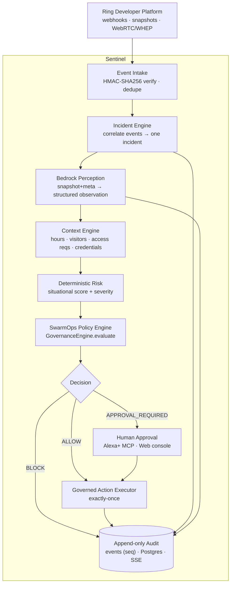

# ARCHITECTURE — Sentinel

> Ground truth as of P00, verified against code (not README claims) in the
> `swarmops` base repo. The backend is a FastAPI + PostgreSQL app with a
> **deterministic governance engine and no LLM in the authorization path**, a
> genuine pause/resume approval flow, an append-only event stream (SSE), and a
> clean LLM provider abstraction. Sentinel reuses that core and adds a
> Ring → Bedrock perception pipeline plus an incident lifecycle on top.

## Architecture invariant

**INTELLIGENCE MAY BE PROBABILISTIC. AUTHORITY MUST BE DETERMINISTIC. NO LLM MAY
AUTHORIZE ITS OWN ACTION.**

Bedrock output is an *observation* (a fact fed into the decision context). The
decision is made by `app/governance/engine.py`, a pure function with no I/O, no
randomness, no time dependence. This invariant is already true in the codebase
(`AgentRunner` makes no governance decision; the orchestrator routes tool requests
through `GovernanceEngine.evaluate`) and Sentinel must preserve it.

## System flow

## Layer mapping: swarmops today → Sentinel

| Concern | Existing code (verified P00) | Sentinel disposition |
|---|---|---|
| Deterministic policy | `governance/engine.py` (pure fn; Scenarios A–E; `DecisionResult` ALLOW/BLOCK/APPROVAL_REQUIRED; stable `policy_id`+`risk_score`) | **REUSE + EXTEND** with entrance scenarios (grant/warn/notify). Keep pure-function contract |
| Lifecycle state machine | `orchestration/state_machine.py` (explicit `ALLOWED` transition map; terminal states) | **REUSE pattern**; add incident-lifecycle transition table |
| Human approval | `services/approval_service.py` (DB-transactional, idempotent-by-conflict) + `orchestration/coordinator.py` (genuine asyncio pause/resume) | **REUSE as-is**; role `security` |
| Append-only audit | `db/models.py::Event` (global `seq`), `repositories.EventRepository` | **REUSE as-is** |
| Live updates | `api/stream.py` SSE + `Last-Event-ID` + coordinator fan-out | **REUSE as-is** |
| Persistence | PostgreSQL + SQLAlchemy 2.0 + Alembic (`alembic/versions/*`) | **REUSE**; add incident tables via a new migration |
| LLM abstraction | `providers/llm/` (`LLMProvider` ABC, factory, `ResilientProvider` + Mock fallback) | **REUSE**; add **`bedrock.py`** provider + perception module |
| Provider seams | `providers/{comms,context,publish}` (sponsor adapters, key-gated, local fallback) | **REUSE pattern** for new Ring/Alexa+ integrations (honest status) |
| Agent reasoning | `agents/agent.py` `AgentRunner` (structured output; makes NO governance decision) | **REUSE pattern** for the officer's perceive→recommend loop; drop the 6-persona workflow |
| 6-agent mission workflow | `orchestration/workflow.py` (CEO/PM/Dev/Sec/QA/Finance dance) | **DO NOT reuse** the persona choreography; build a focused incident workflow reusing the governance/approval/audit calls |
| Self-evolution | `evolution/*` | **Optional**; keep working, not central to Sentinel |
| Cost tracking | `providers/llm/pricing.py`, `CostRecord` | Reuse if useful (Bedrock cost) |

## New components to build (P01+)

1. **Ring Event Intake** (`app/providers/ring/` or `app/ring/`) — OAuth 2.0,
   webhook receiver with **HMAC-SHA256 signature verification**, event
   normalization, snapshot retrieval, and a **simulator/replay source** that emits
   the 23:42 burst deterministically. Honest integration status like the sponsor
   adapters.
2. **Incident Engine** (`app/orchestration/incident_workflow.py` +
   `app/services/incident_service.py`) — correlate an event burst into one
   incident; drive the lifecycle; reuse governance/approval/audit.
3. **Bedrock Perception** (`app/providers/llm/bedrock.py` for reasoning +
   `app/perception/` for snapshot→structured-observation) — behind the existing
   provider abstraction with a deterministic local fallback (so `make test` and
   the no-key demo never call AWS). Uses boto3 `bedrock-runtime`.
4. **Context Engine** (`app/services/context_service.py`) — business hours,
   expected visitors, access requests, credentials → context dict for the engine.
5. **Situational risk** — deterministic; either inside the extended
   `governance/engine.py` or a small `app/governance/incident_risk.py`.
6. **Governed Action Executor** — new tools + an **idempotency guard** for
   exactly-once action delivery (the base has approval-idempotency but no general
   action idempotency table yet).
7. **Alexa+ MCP server** (`app/mcp/` or a sibling app) — self-hosted **Streamable
   HTTP** MCP (spec 2025-11-25+): `list_open_incidents`, `get_incident`,
   `approve_action`, `deny_action`. Mutations route through `approval_service` —
   the MCP cannot bypass authority.
8. **Sentinel console** (`apps/web`) — reskin the live dashboard to a
   **security-officer shift** view (incident timeline, on-duty status, the
   winner-moment chain, approve/deny). Reuse `Timeline`, `ApprovalPanel`,
   `MetricsRail`, the SSE client.

## Decision branches (from `governance/engine.py`, already implemented)

- `BLOCK` → incident denied/blocked, recorded, terminal.
- `APPROVAL_REQUIRED` → open approval (by role) → pause via coordinator → resume
  exactly once on approve; reject → stop safely.
- `ALLOW` → act now.

## Security concerns (Sentinel-specific)

- **Webhook authenticity:** verify Ring HMAC-SHA256 on every event; reject
  unsigned/replayed events (timestamp/nonce window).
- **Secrets:** Ring OAuth tokens + AWS creds in env / secret store only. The
  repo's `.env` is gitignored (verified). Operational note: the developer's local
  `.env` currently holds live sponsor keys — keep it out of git and CI.
- **Perception cannot escalate authority:** low-confidence or absent perception
  resolves to the *more restrictive* branch, never auto-allow (design rule for the
  risk step).
- **Default-deny for physical actions:** `grant_temporary_access` blocks unless
  every precondition holds — the winner moment and the safety property.
- **MCP surface:** the Alexa+ MCP exposes intent, not authority — all mutations
  re-check role in `approval_service`.

## Privacy concerns (Sentinel-specific)

- Ring video/snapshots are **biometric-adjacent PII.** Minimize: send a snapshot
  to Bedrock for perception, persist **only the structured observation + a short
  excerpt/thumbnail reference**, not raw video. Prefer ephemeral handling.
- **No facial recognition / identity matching** in scope — avoids BIPA/GDPR
  special-category processing and keeps the demo defensible.
- Retention: observations + audit are the record; raw media is not the system of
  record. Document in `docs/` alongside the existing docs.
- Entrance monitoring implies notice/consent obligations — call out in product
  docs; out of scope to enforce technically in the hackathon.

## Architectural conflicts to resolve (flagged, not yet fixed)

1. **Governance engine is scenario-hardcoded**, not a general condition engine.
   Extend `evaluate()` with deterministic entrance scenarios (grant/warn/notify)
   mapping to the winner moment. Keep it a pure function. *(Modification, disclosed
   as new work.)*
2. **Domain vocabulary is mission/workforce-shaped.** Introduce **SecurityIncident
   as the governed unit.** Two options: (a) add `security_incidents` tables and
   give `events`/`approvals`/`governance_decisions` a nullable `incident_id`
   (Alembic migration; parallel to `mission_id`); or (b) model each incident as a
   `Mission` row (zero schema churn, some semantic stretch). **Recommend (a)** for
   clarity; decide in P01.
3. **No general exactly-once action mechanism.** The base has approval-idempotency
   and a single post-approval deploy, but no action idempotency table. Add one for
   the Governed Action Executor. *(New, small.)*
4. **Cloud story.** Base hosts web on Vercel, API+Postgres on Render. Sentinel's
   brain is **Bedrock (AWS)** via boto3 — Render can call Bedrock with AWS creds,
   so **no hosting move is required** (cleaner AWS-Builder story than a full GCP
   stack). Optionally deploy the API on AWS later. **Owner decision; default: keep
   Render/Vercel + Bedrock via boto3.**

## Architectural debt found: NONE that violates the invariant

Verified in P00: **no LLM is in the authorization path.** `AgentRunner` documents
and enforces that it makes no governance decision; `workflow._evaluate_and_record`
calls the deterministic `GovernanceEngine.evaluate` and persists/emits the result;
the LLM's `tool_requests` are inputs to that gate, never the decision. Preserve
this contract when adding Bedrock: it feeds **observations into context** and
**prose into explanations**, never a decision.
