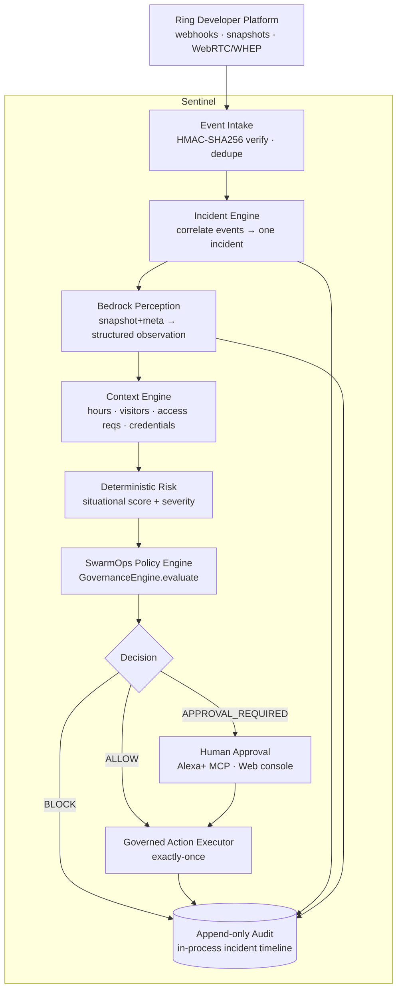

# ARCHITECTURE — Sentinel

> **As-built:** Sentinel is a standalone FastAPI backend (`app/sentinel/*`, `app/mcp/*`)
> with **in-process state and no database**, plus a Next.js `/sentinel` command screen.
> The sections below are the original design notes; "reuse" language refers to the
> deterministic-governance *pattern* and small framework glue, not any product code —
> the final implementation lives entirely under `app/sentinel/` (Ring, Bedrock
> perception, risk/policy, officer, actions) and `app/mcp/`.

## Architecture invariant

**INTELLIGENCE MAY BE PROBABILISTIC. AUTHORITY MUST BE DETERMINISTIC. NO LLM MAY
AUTHORIZE ITS OWN ACTION.**

Bedrock output is an *observation* (a fact fed into the decision context). The
decision is made by `app/governance/engine.py`, a pure function with no I/O, no
randomness, no time dependence. This invariant is already true in the codebase
(`AgentRunner` makes no governance decision; the orchestrator routes tool requests
through `GovernanceEngine.evaluate`) and Sentinel must preserve it.

## System flow

```mermaid
flowchart TB
    RING["Ring Developer Platform<br/>webhooks · snapshots · WebRTC/WHEP"]
    subgraph SENTINEL["Sentinel"]
      INTAKE["Event Intake<br/>HMAC-SHA256 verify · dedupe"]
      INC["Incident Engine<br/>correlate events → one incident"]
      PERC["Bedrock Perception<br/>snapshot+meta → structured observation"]
      CTX["Context Engine<br/>hours · visitors · access reqs · credentials"]
      RISK["Deterministic Risk<br/>situational score + severity"]
      POL["SwarmOps Policy Engine<br/>GovernanceEngine.evaluate"]
      DECIDE{"Decision"}
      HUM["Human Approval<br/>Alexa+ MCP · Web console"]
      EXE["Governed Action Executor<br/>exactly-once"]
      AUD[("Append-only Audit<br/>in-process incident timeline")]
    end

    RING --> INTAKE --> INC --> PERC --> CTX --> RISK --> POL --> DECIDE
    DECIDE -- ALLOW --> EXE
    DECIDE -- BLOCK --> AUD
    DECIDE -- APPROVAL_REQUIRED --> HUM --> EXE
    EXE --> AUD
    INC --> AUD
    PERC --> AUD
```

## As-built layers

| Concern | Where |
|---|---|
| Ring sensing | `app/sentinel/ring/` — HMAC-verified webhooks, Playground simulator, normalize, dedupe, media/live-view adapters, ingest |
| Bedrock perception | `app/sentinel/perception/` — boto3 Converse → strict-JSON observation; deterministic Mock fallback |
| Deterministic risk + policy | `app/sentinel/governance/` — typed, versioned (`config.py`); pure functions, no LLM, no `eval` |
| Incident domain + lifecycle | `app/sentinel/{models,enums,lifecycle,logic}.py` |
| Officer + approvals + audit | `app/sentinel/officer/service.py` — role-scoped, expiring approvals; append-only in-process timeline |
| Governed action execution | `app/sentinel/actions/` — provider + idempotency/concurrency-guarded engine (exactly-once) |
| HTTP surface | `app/api/{ring,perception,governance,sentinel}.py` |
| Alexa+-compatible MCP | `app/mcp/server.py` — Streamable HTTP, spec 2025-11-25 |
| Command screen | `apps/web/app/sentinel/page.tsx` |

State is **in-process** (no database); the authority semantics — deterministic policy,
roles, expiry, exactly-once, append-only audit — are fully enforced in the services above.

## Decision branches (deterministic policy engine)

- `DENY` → action denied and recorded; `grant_temporary_access` is DENY unless every
  precondition holds (business hours ∧ verified visitor ∧ approved request ∧ credential).
- `REQUIRE_APPROVAL` → open a role-scoped, expiring approval → execute **exactly once** on a
  valid approval; reject stops safely.
- `ALLOW` → execute now (exactly once).

## Security concerns (Sentinel-specific)

- **Webhook authenticity:** verify Ring HMAC-SHA256 on every event; reject
  unsigned/replayed events (timestamp/nonce window).
- **Secrets:** Ring OAuth tokens + AWS creds in env / secret store only. The repo's
  `.env` is gitignored; only `.env.example` is tracked.
- **Perception cannot escalate authority:** low-confidence or absent perception
  resolves to the *more restrictive* branch, never auto-allow (design rule for the
  risk step).
- **Default-deny for physical actions:** `grant_temporary_access` blocks unless
  every precondition holds — the winner moment and the safety property.
- **MCP surface:** the Alexa+ MCP exposes intent, not authority — all mutations
  re-check role in `approval_service`.

## Privacy concerns (Sentinel-specific)

- Ring video/snapshots are **biometric-adjacent PII.** Minimize: send a snapshot
  to Bedrock for perception, persist **only the structured observation + a short
  excerpt/thumbnail reference**, not raw video. Prefer ephemeral handling.
- **No facial recognition / identity matching** in scope — avoids BIPA/GDPR
  special-category processing and keeps the demo defensible.
- Retention: observations + audit are the record; raw media is not the system of
  record. Document in `docs/` alongside the existing docs.
- Entrance monitoring implies notice/consent obligations — call out in product
  docs; out of scope to enforce technically in the hackathon.

## Deployment

Web on Vercel, API on Render — **no database**. Sentinel's perception brain is
**Amazon Bedrock** via boto3; Render (or any host) calls Bedrock with AWS creds, so
no additional infrastructure is required. With no keys, Ring uses the Playground
simulator and Bedrock falls back to a deterministic Mock.

## Invariant upheld

**No LLM is in the authorization path.** Perception output is rejected if it carries
any authority field (`app/sentinel/perception/parse.py`); the decision is produced
solely by the deterministic risk + policy engines (`app/sentinel/governance/`); the AI
recommendation only selects which action to evaluate, never the outcome. Bedrock feeds
**observations into context** and **prose into explanations** — never a decision.
